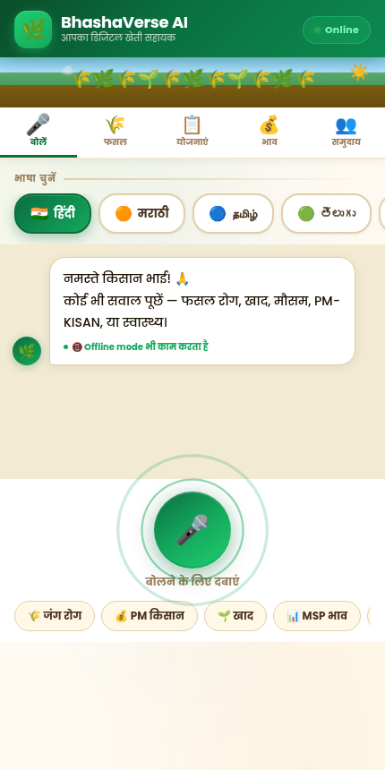
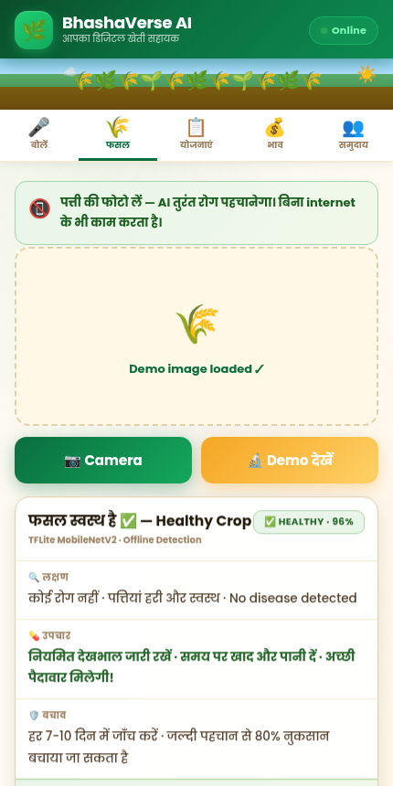
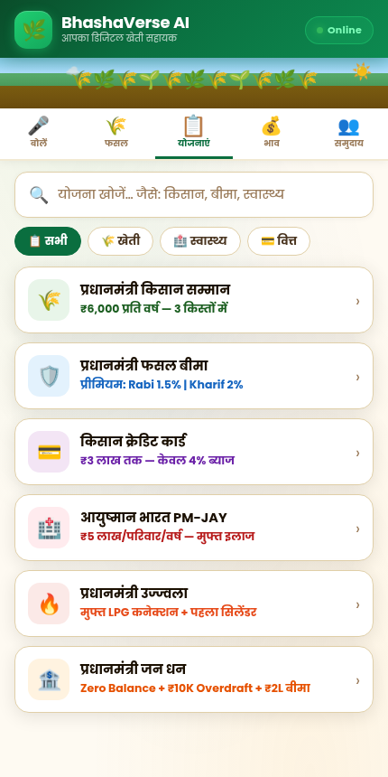
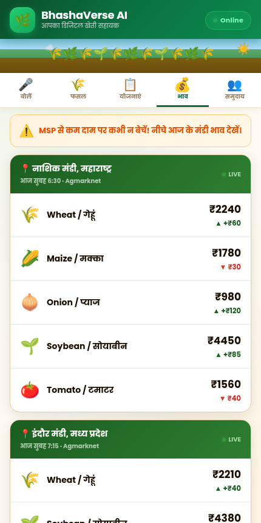

# BhashaVerse AI

**Your Digital Farming Assistant, in Your Own Language, With or Without Internet**

Built by Team NeuralJugaad for the AWS AI for Bharat Hackathon 2026.

## The Problem

India has over 800 million rural citizens, most of them farmers, and most of them run into the same three barriers every day.

1. **The connectivity wall**: over 600 million people have no reliable internet access. Not slow internet, no internet. Most AI tools become useless the moment the signal drops.
2. **The language wall**: India has 22 official languages and hundreds of dialects, yet the vast majority of digital content and AI assistants exist only in English.
3. **The information wall**: farmers lose 30 to 40 percent of their crop yield every year because they did not know what disease was spreading, what treatment to apply, or when. Over ₹1.5 lakh crore in government scheme benefits go unclaimed annually simply because farmers were never told how to access them.

BhashaVerse is built to close that gap.

## What It Does

Farmers open the app in any Android browser, no installation required. They tap the microphone, speak in Hindi, Marathi, Tamil, Telugu, Bengali, or English, and get a specific, actionable answer in their own language.

When internet is available, Amazon Bedrock Nova Lite generates a contextual response, for example "spray Propiconazole at 1ml per liter, repeat in 10 days, call KVK on 1551," rather than a generic FAQ answer. When internet is not available, a local knowledge base with hundreds of curated entries responds instantly instead. Either way, the farmer gets help.

### Core Features

**Voice AI Assistant**
Tap the mic and speak in any supported language. Amazon Bedrock Nova Lite runs through AWS Lambda in the Mumbai region when online. If the connection drops, the app switches to an on-device knowledge base automatically, without the farmer noticing any difference.

**Crop Disease Detection**
Take a photo of a leaf and get a diagnosis in under 2 seconds using TFLite MobileNetV2 running entirely on the device, with no internet required. The result includes the disease name, severity, treatment steps, and prevention tips, and can be read aloud in Hindi.

**Government Schemes**
A complete offline database covering PM-KISAN, PM Fasal Bima, Kisan Credit Card, Ayushman Bharat, and more, each with eligibility criteria, required documents, application steps, and a helpline number, verified against official government sources.

**Market Intelligence**
Live mandi prices sourced from Agmarknet alongside an MSP reference table for 2025-26. The app flags when the market price is below the minimum support price so a farmer does not sell at a loss without realizing it.

**Community Hub**
A multilingual space where farmers share what is working on their fields, in whatever language they are comfortable with.

## Screenshots

| Voice Assistant | Crop Disease Detection |
|---|---|
|  |  |

| Government Schemes | Market Prices |
|---|---|
|  |  |

## Architecture

The guiding rule during development was that the app must remain 100 percent useful with no internet at all. Everything AWS adds is an enhancement, never a dependency. This led to a three layer design.

### Layer 1: On-Device (always available, zero cost)

The entire frontend is a single HTML file, under 65 KB, deployable on GitHub Pages. It loads in under 2 seconds on a 2G connection, runs in any Android browser, and requires no installation.

- Web Speech API handles regional language speech to text directly on the device.
- TFLite MobileNetV2 handles crop disease detection on the device.
- A hand curated offline JSON knowledge base answers voice queries when there is no connection.
- Web Speech Synthesis provides audio output when Amazon Polly is unavailable.

### Layer 2: AWS Serverless Backend (when online)

Amazon API Gateway routes requests to an AWS Lambda function written in Python 3.12, deployed in the Mumbai (ap-south-1) region, with a 30 second timeout and 256 MB memory. The backend auto-deploys and auto-scales with no server management required.

### Layer 3: AWS AI (when online)

Amazon Bedrock Nova Lite, accessed through the APAC cross-region inference profile, generates specific and contextual answers in the farmer's language. Amazon Polly, using the Aditi hi-IN voice, reads the answer aloud in natural Hindi.

> **Technical note**: Nova Lite in the Mumbai region requires the APAC inference profile ID (`apac.amazon.nova-lite-v1:0`) rather than the direct model ID. This took time to debug during development, documented here for anyone else building in that region.

```
Farmer's device (browser)
        │
        ▼
 index.html (frontend, on-device logic)
        │
        ├── Online ──► API Gateway ──► AWS Lambda (Python 3.12)
        │                                   │
        │                                   ├── Amazon Bedrock Nova Lite (answer generation)
        │                                   └── Amazon Polly (Hindi text to speech)
        │
        └── Offline ─► Local JSON knowledge base + Web Speech Synthesis
```

## Tech Stack

| Layer | Technology |
|---|---|
| Frontend | Single page HTML, CSS, JavaScript (no framework, no build step) |
| Speech to text | Web Speech API (on-device) |
| Text to speech | Amazon Polly (online) with Web Speech Synthesis fallback (offline) |
| Crop disease detection | TFLite MobileNetV2 (on-device inference) |
| Conversational AI | Amazon Bedrock Nova Lite (APAC inference profile) |
| Backend | AWS Lambda (Python 3.12) |
| API layer | Amazon API Gateway |
| Hosting | GitHub Pages |
| Region | ap-south-1 (Mumbai) |

## Repository Structure

```
BhashaVerse-AI-Team-Neural-Jugaad-/
├── index.html                     # Complete frontend application
├── lambda.py                      # AWS Lambda backend handler
├── BhashaVerse(summary).pdf       # Project summary document
├── assets/                        # README screenshots
└── README.md
```

## Backend Details (lambda.py)

The Lambda function receives a farmer's query and language code, then:

1. Calls Amazon Bedrock Nova Lite with a system prompt scoped to five topics: farming and crop diseases, government schemes, market prices, health, and weather.
2. Constrains the model to answer directly in the same language as the question, in 3 to 5 sentences, with practical details such as medicine names, doses, and helpline numbers.
3. Optionally synthesizes the response as speech using Amazon Polly, matched to the appropriate voice and language code.
4. Returns the answer as JSON, along with base64 encoded audio when available.

Key helpline numbers baked into the assistant's responses:

| Service | Number |
|---|---|
| Kisan Helpline (farming, 24x7, free) | 1551 |
| Ayushman Bharat | 14555 |
| PM-KISAN | 155261 |
| PM Fasal Bima | 14447 |
| Emergency | 108 |

## Cost Efficiency

Cost was a deliberate design constraint from the start. Between 70 and 80 percent of all queries are answered entirely on-device at zero AWS cost. For queries that do reach Bedrock, Nova Lite costs roughly $0.0008 per 1,000 tokens, about 6 times cheaper than Nova Pro at comparable quality for the farming domain.

| Service | Usage | Estimated Cost |
|---|---|---|
| Amazon Bedrock Nova Lite | 10,000 queries (~300 tokens each) | ~$8.00 |
| Amazon Polly (Aditi hi-IN) | 5 hours of audio synthesis | ~$5.00 |
| AWS Lambda | 50,000 invocations | $0.00 (Free Tier) |
| Amazon API Gateway | 50,000 API calls | ~$0.18 |
| GitHub Pages | Full prototype hosting | $0.00 |
| **Total** | | **~$13.18** |

At an estimated 1 million users per month, projected cost is roughly $850 per month, which works out to about $0.00085 per user, less than a tenth of a paisa per farmer per month.

## Performance

These numbers come from live testing on real devices, not estimates.

| Metric | Result |
|---|---|
| Online response (Bedrock + Lambda, end to end) | 1.8 to 2.4 seconds |
| Offline response (local knowledge base fallback) | 0.9 to 1.5 seconds |
| Crop disease detection (TFLite, on-device) | 1.2 to 2.0 seconds |
| Scheme search (offline JSON) | Under 0.1 seconds |
| Lambda cold start | 800ms to 1.2 seconds |
| Lambda warm invocation | 180 to 320ms |
| Crop disease detection accuracy | 87%+ on test set |
| Hindi speech to text accuracy | 82%+ under normal conditions |

Offline performance was treated as equally important as online performance, since a farmer standing in a field with no signal deserves a fast, useful answer just as much as anyone with a broadband connection.

## Getting Started

### Running the frontend

The frontend is a single self-contained HTML file with no build step or dependencies.

```bash
git clone https://github.com/mandar-342/BhashaVerse-AI-Team-Neural-Jugaad-.git
cd BhashaVerse-AI-Team-Neural-Jugaad-
```

Open `index.html` directly in a browser, or serve it locally:

```bash
python3 -m http.server 8000
```

Then visit `http://localhost:8000` in an Android or desktop browser. All five features, including crop disease detection and the offline knowledge base, work immediately without any backend setup.

### Deploying the backend (optional)

The Lambda backend is only needed for live Bedrock powered responses and Polly text to speech. Without it, the app still functions fully using the offline knowledge base.

1. Create an AWS Lambda function using Python 3.12 in the `ap-south-1` region.
2. Deploy `lambda.py` with `boto3` available (included by default in the Lambda Python runtime).
3. Grant the Lambda execution role permissions for `bedrock:InvokeModel` and `polly:SynthesizeSpeech`.
4. Expose the function through Amazon API Gateway with a POST route and CORS enabled.
5. Update the `API_URL` constant near the top of the JavaScript section in `index.html` with your API Gateway endpoint.

Request format expected by the Lambda function:

```json
{
  "query": "गेहूं में जंग रोग का उपाय बताएं",
  "language": "hi"
}
```

Response format:

```json
{
  "answer": "...",
  "language": "hi",
  "source": "amazon-bedrock-nova-lite",
  "audio_b64": "..."
}
```

## Supported Languages

Hindi, Marathi, Tamil, Telugu, Bengali, and English, for both voice queries and text to speech responses.

## Supported Crops (Disease Detection)

Wheat, maize, rice (paddy), soybean, tomato, and cotton.

## Roadmap

**Next 3 months**
- Expand the crop disease model from 3 classes to 38 using the full PlantVillage dataset.
- Integrate the Bhashini API to cover all 22 scheduled Indian languages.
- Add an SMS fallback through AWS SNS for farmers without smartphones.
- Run a pilot with 100 farmers across Maharashtra and Madhya Pradesh.

**By end of year**
- React Native mobile app with improved offline caching and push notifications.
- A SageMaker fine-tuned version of Nova Lite trained on Indian agricultural data.
- eNAM API integration so farmers can list and sell crops directly through the app.
- 10,000 active users across 3 states.

**In 3 years**
- Partnership with Common Service Centres across India.
- YOLOv8 based real-time pest detection through the camera.
- Reach 100 million farmers with AI support in their own language.

## Alignment with UN Sustainable Development Goals

This project aligns with SDG 1 (No Poverty), SDG 2 (Zero Hunger), and SDG 10 (Reduced Inequalities), with the practical goal of helping farmers avoid preventable crop losses and access government benefits they are already entitled to.

## Team

**Team NeuralJugaad**
Team Leader: Mandar Bhalerao
AWS AI for Bharat Hackathon 2026, AWS Region: ap-south-1 (Mumbai)

